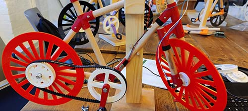

# Girls into Coding Bicycle Activity

In this activity, participants build a model bicycle and then convert it to an e-bike.

The project is built using a Raspberry Pi Pico, hall sensor, LED display and a few other components.

Programming is in Python.

This repo contains code for the Pico.

Please go to [www.thinkcreatelearn.co.uk](www.thinkcreatelearn.co.uk) for more details.